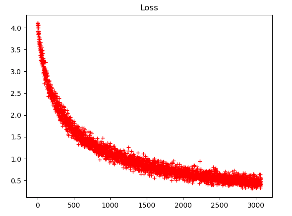

# GTSRB-torch
Image classification using pytorch on German Traffic Sign data set

## Project: Build a Traffic Sign Recognition Program


Overview
---
In this project, you will use what you've learned about deep neural networks and convolutional neural networks to classify traffic signs. You will train and validate a model so it can classify traffic sign images using the [German Traffic Sign Dataset](http://benchmark.ini.rub.de/?section=gtsrb&subsection=dataset). After the model is trained, you will then try out your model on images of German traffic signs that you find on the web.

### Dependencies
This project requires

* [pytorch]


### Dataset and Repository

1. Download the data set. 
2. Clone the project
```sh
git clone https://github.com/gautam-sharma1/GTSRB-torch.git
cd GTSRB-torch
python main.py
```

# **Model Architecture** 

My final model consisted of the following layers:

| Layer         		|     Description	        					| 
|:---------------------:|:---------------------------------------------:| 
| Input         		| 32x32x3 RGB image   							| 
| Convolution 5x5     	| 1x1 stride, same padding, outputs 28x28x100 	|
| RELU					|												|
| Convolution 3x3      	| 1x1 stride, same padding, outputs 14x14x150 			|
| RELU					|												|
| Convolution 1x1   	| 1x1 stride, same padding, outputs 8x8x250 			|
| RELU					|												|
| Max Pool		2x2		|		2x2 stride, outputs 3x3x250										|
| Fully connected		|Input = 250X3X3, Output = 350      									|
| RELU					|												|
| Dropout				|	keep_prob = 0.5											|
| Fully connected		|Input = 350, Output = 43     									|
| Softmax				| 43 classes			|												|      									|


To train the model, I used a learning rate of 0.001 with 10 EPOCHS and a Batch Size of 128. I also used SGDAdam Optimizer as it tends to perform better than SGD.


 

### Test a Model on New Images

#### 1. Choose five German traffic signs found on the web and provide them in the report. For each image, discuss what quality or qualities might be difficult to classify.

Here are five German traffic signs that I found on the web:


 


